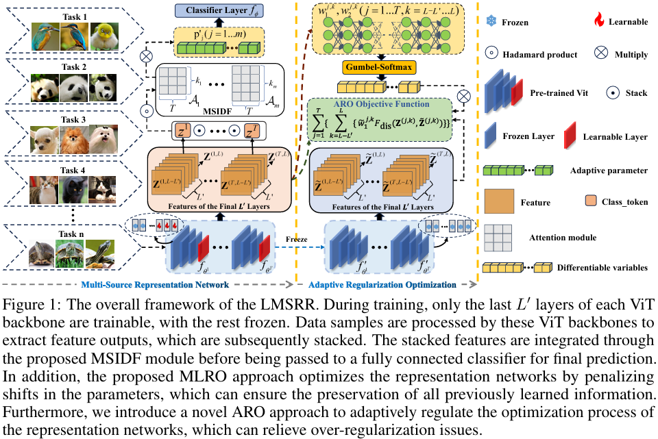

# 🚀 LMSRR

[](https://www.python.org/) [](https://openreview.net/pdf?id=24vq7c6MpR)   

Code for paper **"[Learning Multi-Source and Robust Representations for Continual Learning](https://openreview.net/pdf?id=24vq7c6MpR)"** NeurIPS2025.

------

## 📌 Table of Contents

- [Introduction](#introduction)
- [Framework Overview](#framework-overview)
- [Key Contributions](#key-contributions)
- [Installation](#installation)
- [Usage](#usage)
- [Citation](#citation)
- [Acknowledgement](#acknowledgement)

------

## 🔍 Introduction

Continual learning models must strike a delicate balance between **plasticity** (learning new tasks effectively) and **stability** (retaining previous knowledge). Although many recent methods utilize pre-trained backbones to improve stability, they largely rely on **a single backbone**, limiting adaptiveness and representation richness.

**LMSRR** introduces a **multi-source, dynamically optimized representation framework**, combining multiple heterogeneous pre-trained models with a novel set of optimization strategies, yielding robust and adaptive features for continual learning.

------

## 🧠 Framework Overview

<div align="center">
  
</div>

LMSRR contains three major components:

### **1. Multi-Scale Interaction & Dynamic Fusion (MSIDF)**

- Interacts multi-source features across scales.
- Learns task-relevant feature selection via attention modules.

### **2. Multi-Level Representation Optimization (MLRO)**

- Dynamically refines backbone layers.
- Improves plasticity while preserving critical representations.

### **3. Adaptive Regularization Optimization (ARO)**

- Learns a switch vector controlling layerwise updating.
- Avoids over-regularization and improves new task learning.

Together, these form a unified optimization framework offering a strong trade-off between **stability** and **plasticity**.

------

## 🌟 Key Contributions

- **Multi-source representation learning** via coordinated pre-trained backbones.
- **Dynamic multi-scale fusion** (MSIDF) capturing cross-source semantic complementarities.
- **Adaptive multi-level optimization** (MLRO) improving plasticity.
- **Layerwise adaptive regularization** (ARO) preventing catastrophic forgetting.
- **State-of-the-art performance** across standard continual learning benchmarks.

------

## ⚙️ Installation

```bash
conda create -n LMSRR4CL python=3.10
conda activate LMSRR4CL
pip install -r requirements.txt
```

------

## ▶️ Usage

### **1. Enter the project directory**

```bash
cd LMSRR/
```

### **2. Run the example training script**

```bash
bash command/lmsrr_cifar10.sh
bash command/lmsrr_cifar100.sh
```

### Project structure overview

```bash
LMSRR/
├── backbone/                 # Pre-trained backbone models
│   ├── lmsrr.py              # LMSRR backbone implementation
│   └── ...
├── command/                  # Training scripts
├── datasets/                 # Dataset loaders
│   └── ...
├── models/                   # Method implementations
│   ├── lmsrr.py              # LMSRR method implementation
│   └── <baseline>.py         # ER, DER++, etc.
├── utils/                    # Helper tools
│   └── ...
├── main.py                   # Main training entry
├── requirements.txt
└── README.md
```

------

## 📝 Citation

If you find this repository helpful, please cite our paper:

```
@inproceedings{ye2025lmsrr,
  title={Learning Multi-Source and Robust Representations for Continual Learning},
  author={Ye, Fei and Zhong, Yongcheng and Liu, Qihe and Bors, Adrian G and Hu, Rongyao and others},
  booktitle={Proceedings of the 39th Conference on Neural Information Processing Systems},
  year={2025}
}
```

------

## 🙏 Acknowledgement

This project is built upon the excellent continual learning framework **[Mammoth](https://github.com/aimagelab/mammoth)**.
We sincerely thank the authors for open-sourcing their work.
